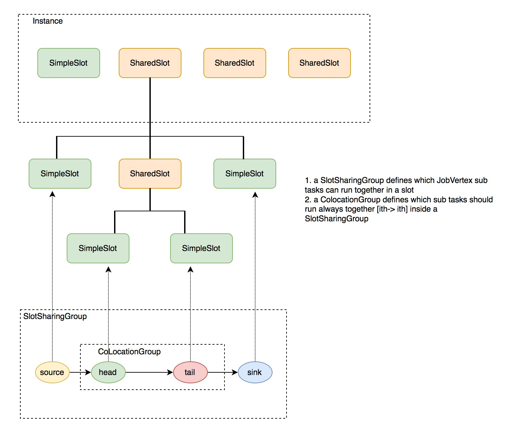
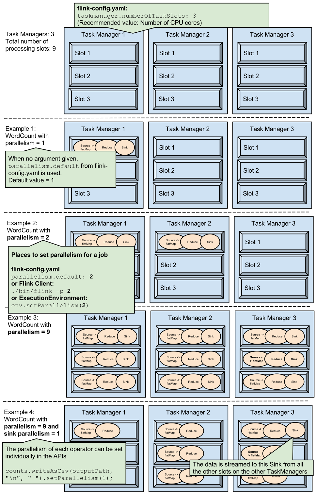

# flink任务调度与负载均衡

## 前言

前面已经介绍了一系列的 flink 任务抽象、网络传输、可靠性机制等细节，有了这些铺垫，终于可以开心的介绍 flink 的任务调度机制了，也是不易^_^

因为没有这些铺垫，就无法明白 flink 为什么要设计这样的一套调度机制！所以本章节讲解时会多穿插一些为什么

## 资源组

### 资源组模型

flink 的一个 Instance 可以被划分出多个 Slot，通过初始参数可以指定，他们既可以是 SimpleSlot，也可以是同时跑多个 task 的 SharedSlot，为了约束 task 之间的运行时的绑定关系，flink 抽象出了 SlotSharingGroup 和 CoLocationGroup 的概念。

一个 SlotSharingGroup 规定了一个 Job 的 DAG 图中的哪些 JobVertex 的 sub task 可以部署到一个 SharedSlot 上，这是一个软限制，并不是一定会满足，只是调度的时候有位置偏好，而 CoLocationGroup 是在 SlotSharingGroup 的基础上的硬限制，它限定了 CoLocationGroup 中的 JobVertex 中的 sub task 运行必须是一一对应的：假如 CoLocationGrou 限定了 JobVertex A 和 B ，那么 A 的编号为 i 的 sub task 必须和 B 的编号为 i 的 sub task 跑在一起。假如一个 job 的运算逻辑包括 source -> head -> tail -> sink，那么它的 task 运行时限制关系见下图：



### 资源组

#### SlotSharingGroup

上面已经提到 SlotSharingGroup 具有绑定 JobVertex 的 sub task 运行的作用，用户可以自己为 JobVertex 定义一个 SlotSharingGroup，如果不定义的话使用名为 default 的 SlotSharingGroup，定义的接口如下：

`someStream.filter(...).slotSharingGroup("name");`

#### ColocationGroup

ColocationGroup 通过 CoLocationConstraint 来管理一个 SharedSlot 上的 sub task

用户同样可以通过 api 定义 ColocationGroup：

### 资源Slot

一个 TaskManager 在初始化时可以指定自己最大持有的 Slot 数，包括 SharedSlot 和 SimpleSlot。

flink 使用 slot 作为资源抽象【主要是 cpu 和 memory】，一个 Instance 可以持有多个 SharedSlot，一个 SharedSlot 可以并行执行多个 sub task，对于 PIPELINED 来说，一种典型的模式就是一个 SharedSlot 同时执行一个 job 每个 JobVertex 上的一个并行 task，这样不仅可以尽量保证每个 Instance 上的任务负载尽量均匀，也能最大化的利用 PIPELINED 的流水线处理特性优化网络传输。

flink 的 slot 有两种：SharedSlot 和 SimpleSlot，前者可以绑定执行多个 sub task，后者代表一个 task 的资源占用。

#### SharedSlot

一个 SharedSlot 可以拥有多个 SimpleSlot，也可以包含嵌套的 SharedSlot【ColocationConstraint】，这样便形成了树形结构，SimpleSlot 和 SharedSlot 继承自共同的接口：Slot，它们都包含如下的关键信息：

- jobID：被哪个 job 占有
- groupID：属于哪个 SlotSharingGroup
- instance：属于哪个 TaskManager，或者属于哪个物理节点
- status：当前分配状态，共有四种状态 ALLOCATED_AND_ALIVE、CANCELLED、RELEASED、unknown

*只有定义了 SlotSharingGroup 时才会通过 SharedSlot 来绑定 sub task 的执行*

#### SimpleSlot

SimpleSlot 是执行单个 task 的 slot 抽象，它既可以在 TaskManager 上独立存在，也可以作为 SharedSlot 的子节点，内部封装了一个 task 的一次 Execution

继承关系下如下图：

SharedSlot 可以视作管理 SimpleSlot 的工具，那么 SharedSlot 自身又由什么方式管理呢？

#### SlotSharingGroupAssignment

flink 通过抽象 SlotSharingGroupAssignment 来管理 SharedSlot，这里的资源以  JobVertex 微粒度划分 group，也就是一个 JobVertex 占有一个资源 group。

##### Slot初始划分

SlotSharingGroupAssignment 是如何添加一个初始的 SharedSlot 节点的呢？

```java
//SlotSharingGroupAssignment line174
private SimpleSlot addSharedSlotAndAllocateSubSlot(SharedSlot sharedSlot, Locality locality,
													JobVertexID groupId, CoLocationConstraint constraint) {
		// sanity checks
		if (!sharedSlot.isRootAndEmpty()) {
			throw new IllegalArgumentException("The given slot is not an empty root slot.");
		}
```

总结其逻辑：

- 这里必须是一个根节点 SharedSlot【没有父亲节点和子节点】，也就是 TaskManager 被配置的一个 Slot
- 如果没有强制的 task 位置绑定【ColocationConstraint】，从根 SharedSlot 上分配一个 SImpleSlot，编号为递增的 simple slot 个数
- 如果有 ColocationConstraint 限制，为传入的 SharedSlot 生成一个子 SharedSlot 并分配 SimpleSlot 注册到 ColocationConstraint 中
- 如果申请到 slot【simple or shared】，设置位置偏好：LOCAL、NON_LOCAL、UNCONSTRAINED【相对于持有的 Instance 来说】，并且将这个 SharedSlot 加入到其它 JobVertex 的可调度资源队列中，也就是说其它的 JobVertex 都可以讲在这个 SharedSlot 上部署自己的 sub task

##### 为Task分配 SharedSlot

最底层的分配策略：

```java
//SlotSharingGroupAssignment line408
private Pair<SharedSlot, Locality> getSlotForTaskInternal(AbstractID groupId,
																Iterable<Instance> preferredLocations,
																boolean localOnly)
	{
		// check if there is anything at all in this group assignment
		if (allSlots.isEmpty()) {
			return null;
		}

		// get the available slots for the group
		Map<Instance, List<SharedSlot>> slotsForGroup = availableSlotsPerJid.get(groupId);
```

总结其逻辑：

- 判断对应的 group 是否有资源，如果没有将 SlotSharingGroupAssignment 目前所有的 SharedSlot 槽位视为可用资源
- 如果对偏好位置有要求，从 group 里筛选是否有满足的 SharedSlot，如果有设置 Locality 为 LOCAL 并返回，同时从该 group 的资源组中移除该 SharedSlot
- 如果对位置有要求但是没有找到符合的 SharedSlot，则从资源组里选择第一个可用的 SharedSlot，并将 Locality 设置为 `Locality.NON_LOCA`
- 如果对位置没要求，则从资源组里选择第一个可用的 SharedSlot，并将 Locality 设置为 `Locality.UNCONSTRAINED`
- 如果没资源，返回 null
- 一旦一个 group 中的 SharedSlot 被分出去就会被从资源池中删除，也就是说一个 SharedSlot 不可能分配一个 JobVertex 的两个 sub tasks，这一点非常重要

###### 无 CoLocationConstraint 限制的资源划分策略

主要是从走上面的逻辑，细节这里就不说了

###### 有 CoLocationConstraint 限制的资源划分策略

有 CoLocationConstraint 限制的时候，优先考虑 CoLocationConstraint 中的 SharedSlot【如果之前 CoLocationGroup 中的其它 task 分配过】，如果 CoLocationConstraint 中还没有分配 SharedSlot 则重新分配，并且再分配一个 SharedSlot 子节点，再这个节点上划出 SimpleSlot 供 task 使用

```java
//SlotSharingGroupAssignment line333
SimpleSlot getSlotForTask(CoLocationConstraint constraint, Iterable<Instance> locationPreferences) {
		synchronized (lock) {
			if (constraint.isAssignedAndAlive()) {
				// the shared slot of the co-location group is initialized and set we allocate a sub-slot
				final SharedSlot shared = constraint.getSharedSlot();
				SimpleSlot subslot = shared.allocateSubSlot(null);
				subslot.setLocality(Locality.LOCAL);
				return subslot;
			}
			else if (constraint.isAssigned()) {
				// we had an assignment before.
```

- 如果之前 CoLocationGroup 中的其它 sub task 有分配过资源，直接复用这个资源，对应 Locality 属性为 `Locality.LOCAL`
- 如果之前分配过，但是该 SharedSlot 但是却被标记死亡，那么依据之前的 SharedSlot 的所在节点重新分配一次 SharedSlot，再此基础上再分配一个 SharedSlot，后分配 SimpleSlot 返回，对应 Locality 属性为 `Locality.LOCAL`
- 如果是第一次分配，依据节点的偏好位置为参考，并再此基础上再分配一个 SharedSlot，后分配 SimpleSlot 返回，对应 Locality 属性为 `Locality.LOCAL`

## 调度器

flink 调度器的调度单位被抽象为一个 ScheduledUnit，一个 ScheduledUnit 封装了以下信息：Execution、SlotSharingGroup、CoLocationConstraint

flink 的关于调度的细节全部集成于 Scheduler

### 调度细节

 首先来明确下 Scheduler 的调度核心：

```java
//Scheduler line156
private Object scheduleTask(ScheduledUnit task, boolean queueIfNoResource) throws NoResourceAvailableException {
		if (task == null) {
			throw new NullPointerException();
		}
		if (LOG.isDebugEnabled()) {
			LOG.debug("Scheduling task " + task);
		}
```

总结其逻辑：

- 先判断该类型的 ExecutionVertex 是否已强制指定执行节点
- 如果有设置 SlotSharingGroup ，拿到对应的 SlotSharingGroupAssignment 和 ColocationConstraint，走上面描述的接口拿到分配的 SimpleSlot A，如果有 ColocationConstraint，会锁定位置，表示已经获取 SharedSlot 并分配完成，如果这个 SimpleSlot 的 Locality 是 LOCAL【预期的位置】，则立即返回，否则走下面的流程
- 如果上面的过程没有获取到 SimpleSlot，那么表示当前已经没有符合要求的 SharedSlot，这时候会重新分配一个新的 SharedSlot，方式是先遍历当前有资源的 Instance 依据偏好位置找到其中一个，并在 SlotSharingGroupAssignment 中注册返回一个新的 SimpleSlot B【细节上面介绍 SlotSharingGroupAssignment 时已说明】
- 如果已走到这一步，比较 A 与 B 的优劣，主要是调度位置是否符合预期的比较，选择更优的，释放掉另一个
- 如果没有 SlotSharingGroup 的约束，直接从 Instance 上申请一个根 SimpleSlot 来执行这个 task
- 以上调度器在分配 SharedSlot 的时候维护了一个队列：`instancesWithAvailableResources`，每次有 Slot 资源的 Instance 被加入对列尾部，消费过的 Slot 会被 remove，这样可以轮询机器，可以使机器的 SharedSlot 分配尽量均衡

#### 约束信息的生成

影响上面调度预期位置有三个重要因素：SlotSharingGroup、ColocationConstraint、prefferedLocations，我们逐一分析它们的生成逻辑：

##### SlotSharingGroup

向上追溯我们发现，Scheduler 的调度逻辑由 Execution 触发：

```java
//Execution line265
public boolean scheduleForExecution(Scheduler scheduler, boolean queued) throws NoResourceAvailableException {
   if (scheduler == null) {
      throw new IllegalArgumentException("Cannot send null Scheduler when scheduling execution.");
   }

   final SlotSharingGroup sharingGroup = vertex.getJobVertex().getSlotSharingGroup();
   final CoLocationConstraint locationConstraint = vertex.getLocationConstraint();

   // sanity check
   if (locationConstraint != null && sharingGroup == null) {
      throw new RuntimeException("Trying to schedule with co-location constraint but without slot sharing allowed.");
   }
 
//StreamingJobGraphGenerator line416
private void setSlotSharing() {

		Map<String, SlotSharingGroup> slotSharingGroups = new HashMap<>();

		for (Entry<Integer, JobVertex> entry : jobVertices.entrySet()) {

			String slotSharingGroup = streamGraph.getStreamNode(entry.getKey()).getSlotSharingGroup();

			SlotSharingGroup group = slotSharingGroups.get(slotSharingGroup);
			if (group == null) {
				group = new SlotSharingGroup();
				slotSharingGroups.put(slotSharingGroup, group);
			}
			entry.getValue().setSlotSharingGroup(group);
		}
  
//StreamGraphGenerator line577
private String determineSlotSharingGroup(String specifiedGroup, Collection<Integer> inputIds) {
		if (specifiedGroup != null) {
			return specifiedGroup;
		} else {
			String inputGroup = null;
			for (int id: inputIds) {
				String inputGroupCandidate = streamGraph.getSlotSharingGroup(id);
				if (inputGroup == null) {
					inputGroup = inputGroupCandidate;
				} else if (!inputGroup.equals(inputGroupCandidate)) {
					return "default";
				}
			}
			return inputGroup == null ? "default" : inputGroup;
		}
	}
```

总结其逻辑：

- 如果用户没有为 JobVertex 指定 SlotSharingGroup ，则生成名为 'default‘ 的 SlotSharingGroup，否则为每个用户指定的名字定义一个 SlotSharingGroup
- 同一个 SlotSharingGroup 中的节点的 sub task 会共享 SharedSlot 资源

##### ColocationConstraint

```java
//CoLocationGroup line81
public CoLocationConstraint getLocationConstraint(int subtask) {
		ensureConstraints(subtask + 1);
		return constraints.get(subtask);
	}
	
	private void ensureConstraints(int num) {
		if (constraints == null) {
			constraints = new ArrayList<CoLocationConstraint>(num);
		} else {
			constraints.ensureCapacity(num);
		}
		
		if (num > constraints.size()) {
			constraints.ensureCapacity(num);
			for (int i = constraints.size(); i < num; i++) {
				constraints.add(new CoLocationConstraint(this));
			}
		}
	}
```

总结其逻辑：

- CoLocationGroup 的生成逻辑和 SlotSharingGroup 类似，不过这个没有默认，需要用户手动指定，并且前提是需要有 SlotSharingGroup
- 从 CoLocationGroup 内 sub task 的 index 获取一个 ColocationConstraint，这样便实现了一一对应关系

##### prefferedLocations

这是调度位置信息的关键，不管是 CoLocationGroup 还是 SlotSharingGroup，都会优先参考节点偏好来申请资源，那么 flink 是依据什么信息来生成偏好位置的呢？

```java
//ExecutionVertex line373
public Iterable<Instance> getPreferredLocations() {
		// if we have hard location constraints, use those
		List<Instance> constraintInstances = this.locationConstraintInstances;
		if (constraintInstances != null && !constraintInstances.isEmpty()) {
			return constraintInstances;
		}

		// otherwise, base the preferred locations on the input connections
		if (inputEdges == null) {
			return Collections.emptySet();
		}
```

总结其逻辑：

- flink 计算节点的上游所有生产者所在节点，并作为自己的偏好位置
- 清空之前旧的偏好位置

*这样就形成了最开始【资源组模型】一节中的调度模式，因为一开始的 source task 显然没有 prefferedLocations，由调度细节可以知道 flink 会轮询集群的不同 Instance，将 source task 分配在这些机器上，后面的 source task 的 consumer task 会优先调度到 source task 的节点上，这样便形成了一开始的调度模式！*

### 触发调度

- 第一次提交任务时
- 有新的 Instance 或者新的 Slot 获取时，会轮询排对的调度任务进行调度

### 调度流程

*这里只介绍 streaming 的流程，批处理类似，有兴趣的童鞋自行研究！*

先梳理代码逻辑：

```java
//ExecutionGraph line 716
//schedule from source JobVertex first
public void scheduleForExecution(Scheduler scheduler) throws JobException {
		if (scheduler == null) {
			throw new IllegalArgumentException("Scheduler must not be null.");
		}

		if (this.scheduler != null && this.scheduler != scheduler) {
			throw new IllegalArgumentException("Cannot use different schedulers for the same job");
		}

		if (transitionState(JobStatus.CREATED, JobStatus.RUNNING)) {
			this.scheduler = scheduler;

			switch (scheduleMode) {

				case FROM_SOURCES:
					// simply take the vertices without inputs.
					for (ExecutionJobVertex ejv : this.tasks.values()) {
						if (ejv.getJobVertex().isInputVertex()) {
							ejv.scheduleAll(scheduler, allowQueuedScheduling);
						}
					}
					break;

//NetworkEnvironment line348
//For PIPELINED, eagerly notify is true, when source tasks is deployed and registered in NetworkEnvironment, will trigger consumer task to deploy
for (ResultPartition partition : producedPartitions) {
			// Eagerly notify consumers if required.
			if (partition.getEagerlyDeployConsumers()) {
				jobManagerNotifier.notifyPartitionConsumable(
						partition.getJobId(), partition.getPartitionId());
			}
		}
                
//NetworkEnvironment line467
public void notifyPartitionConsumable(JobID jobId, final ResultPartitionID partitionId) {

			final ScheduleOrUpdateConsumers msg = new ScheduleOrUpdateConsumers(jobId, partitionId);

			Future<Object> futureResponse = jobManager.ask(msg, jobManagerMessageTimeout);

			...
//Explain why for PIPELINED, eagerlyDeployConsumers is always true here.
//JobVertex line371
public JobEdge connectNewDataSetAsInput(
			JobVertex input,
			DistributionPattern distPattern,
			ResultPartitionType partitionType,
			boolean eagerlyDeployConsumers) {

		IntermediateDataSet dataSet = input.createAndAddResultDataSet(partitionType);
		dataSet.setEagerlyDeployConsumers(eagerlyDeployConsumers);

		JobEdge edge = new JobEdge(dataSet, this, distPattern);
		this.inputs.add(edge);
		dataSet.addConsumer(edge);
		return edge;
	}
  
//StreamingJobGraphGenerator line371
if (partitioner instanceof ForwardPartitioner) {
			downStreamVertex.connectNewDataSetAsInput(
				headVertex,
				DistributionPattern.POINTWISE,
				ResultPartitionType.PIPELINED,
				true);
		} else if (partitioner instanceof RescalePartitioner){
			downStreamVertex.connectNewDataSetAsInput(
				headVertex,
				DistributionPattern.POINTWISE,
				ResultPartitionType.PIPELINED,
				true);
		} else {
			downStreamVertex.connectNewDataSetAsInput(
					headVertex,
					DistributionPattern.ALL_TO_ALL,
					ResultPartitionType.PIPELINED,
					true);
		}
              
//ResultPartition line244
//Also for a ResultPartition, when is has first buffer produced, it will notify JobManager to deploy it's consumer tasks
public void add(Buffer buffer, int subpartitionIndex) throws IOException {
		boolean success = false;

		try {
			checkInProduceState();

			final ResultSubpartition subpartition = subpartitions[subpartitionIndex];

			synchronized (subpartition) {
				success = subpartition.add(buffer);

				// Update statistics
				totalNumberOfBuffers++;
				totalNumberOfBytes += buffer.getSize();
			}
		}
		finally {
			if (success) {
				notifyPipelinedConsumers();
			}
			else {
				buffer.recycle();
			}
		}
	}
  
//ResultPartition line440
//Only PIPELINED will work here
private void notifyPipelinedConsumers() throws IOException {
		if (partitionType.isPipelined() && !hasNotifiedPipelinedConsumers) {
			partitionConsumableNotifier.notifyPartitionConsumable(jobId, partitionId);

			hasNotifiedPipelinedConsumers = true;
		}
	}
```

简单总结：

- 对于 PIPELINED，在 source tasks 部署完成后立马会触发一次下游 consumer tasks 的部署
- 在生产者 task 产生第一个 buffer 数据的时候也会触发一次 consumer tasks 的部署

附一张图解释该流程：


再附上官方的一张经典调度图：



### Slot的资源隔离

待更新